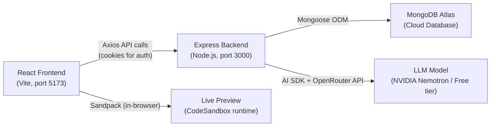
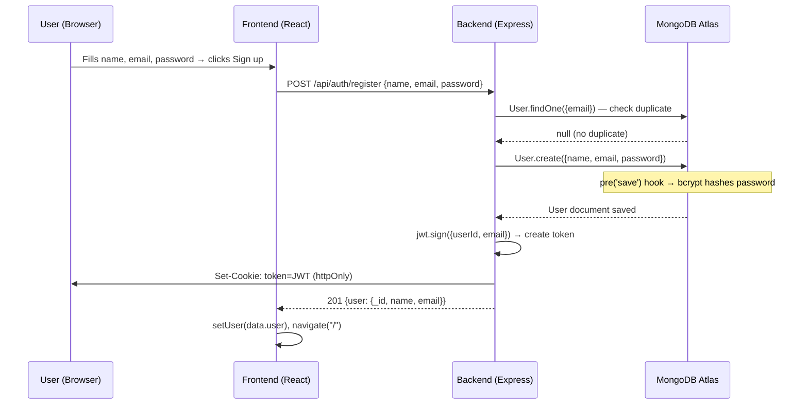
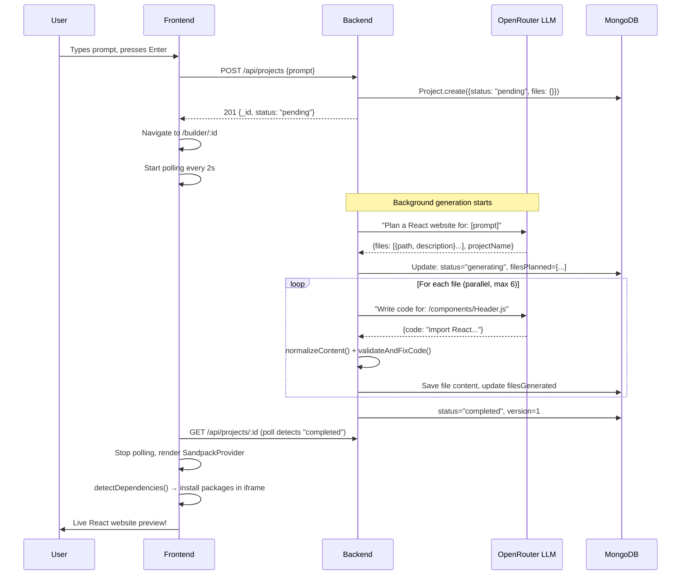

# BuilderAI — Complete Technical Workflow (Interview Guide)

> A full-stack AI-powered website builder that lets users describe a website in plain English and get a live, editable, publishable React website — all from a single prompt.

---

## 🏗️ High-Level Architecture



### Tech Stack Summary

| Layer | Technology | Purpose |
|-------|-----------|---------|
| Frontend | React + Vite | SPA with routing, context state management |
| Styling | TailwindCSS (CDN in generated sites) | Frontend UI uses Tailwind-like utility classes |
| Backend | Express.js (ESM modules) | REST API server |
| Database | MongoDB Atlas + Mongoose | User accounts, projects, file storage |
| AI | Vercel AI SDK + OpenRouter | Structured JSON generation via LLM |
| Live Preview | Sandpack (by CodeSandbox) | In-browser React compiler and renderer |
| Auth | JWT + HTTP-only cookies | Session-based stateless authentication |

---

## 🔐 FLOW 1: User Registration

Here's exactly what happens when you click "Sign up" on the registration page:

### Step 1 — Frontend: User fills the form
- You land on `/register` route → renders [AuthPage.jsx](file:///c:/Manish/buider-ai/frontend/src/pages/AuthPage.jsx) with `mode="register"`
- [Layout.jsx](file:///c:/Manish/buider-ai/frontend/src/pages/Layout.jsx) has a `GuestLayout` wrapper — it checks if a user is already logged in via `useAppContext()`. If logged in, it redirects to `/`. If not, it shows the auth page.
- You type your name, email, password and hit "Sign up"

### Step 2 — Frontend: `handleSubmit` → `register()` in AppContext
```
AuthPage.handleSubmit()
  → calls register(name, email, password) from AppContext
    → POST /api/auth/register  (via Axios with withCredentials: true)
```
- [AppContext.jsx](file:///c:/Manish/buider-ai/frontend/src/context/AppContext.jsx) (line 63-74): The `register` function sends `{name, email, password}` to the backend

### Step 3 — Backend: Express receives the request
```
POST /api/auth/register
  → Router: authRoutes.js → register() in authController.js
```
- [server.js](file:///c:/Manish/buider-ai/backend/server.js) mounts `app.use('/api/auth', authRouter)`
- [authRoutes.js](file:///c:/Manish/buider-ai/backend/routes/authRoutes.js) maps `POST /register` → `register` function

### Step 4 — Backend: Create user in MongoDB
Inside [authController.js](file:///c:/Manish/buider-ai/backend/controllers/authController.js) `register()`:

1. **Validation**: Checks `name`, `email`, `password` are all present
2. **Duplicate check**: `User.findOne({email})` — if found, returns 400 error
3. **Create user**: `User.create({name, email, password})`
4. **Password hashing happens automatically** — The [User.js](file:///c:/Manish/buider-ai/backend/models/User.js) model has a Mongoose `pre('save')` hook:
   ```
   UserSchema.pre('save') → bcrypt.genSalt(10) → bcrypt.hash(password, salt)
   ```
   So the plain-text password is **never stored** — only the bcrypt hash.
5. **JWT token creation**: `jwt.sign({userId, email}, JWT_SECRET, {expiresIn: '30d'})`
6. **Set HTTP-only cookie**: The token is placed in a cookie named `token` with:
   - `httpOnly: true` — JavaScript on the frontend **cannot** read this cookie (XSS protection)
   - `sameSite: 'lax'` — CSRF protection
   - `maxAge: 30 days`
7. **Response**: Returns `{user: {_id, name, email}}` (no password in response)

### Step 5 — Frontend: Receives response, updates state
- `setUser(data.user)` — stores user in React context
- `toast.success("Account created successfully!")` — shows notification
- `navigate("/")` — redirects to HomePage

### Step 6 — Session persistence (on page reload)
- When the app first loads, [AppContext.jsx](file:///c:/Manish/buider-ai/frontend/src/context/AppContext.jsx) runs `checkSession()` in a `useEffect` on mount
- This calls `GET /api/auth/me`
- Backend: [authMiddleware.js](file:///c:/Manish/buider-ai/backend/middleware/authMiddleware.js) reads the `token` cookie → `jwt.verify()` → attaches `req.user = decoded`
- [authController.js](file:///c:/Manish/buider-ai/backend/controllers/authController.js) `me()` → `User.findById(req.user.userId).select("-password")` → returns user data
- This is how you stay logged in even after refreshing the page



---

## 🌐 FLOW 2: Generating a Website from a Prompt

This is the **core feature**. Here's every internal step when you type *"Create a portfolio website for Manish Jaiswal, AI engineer"* and press Enter:

### Step 1 — Frontend: User submits prompt on HomePage
- [HomePage.jsx](file:///c:/Manish/buider-ai/frontend/src/pages/HomePage.jsx) renders a `PromptInput` component
- [PromptInput.jsx](file:///c:/Manish/buider-ai/frontend/src/components/PromptInput.jsx): When you press Enter or click submit, it calls `onSubmit(trimmedValue)` → which is `handleGenerate` from AppContext

### Step 2 — Frontend: `handleGenerate()` sends API request
[AppContext.jsx](file:///c:/Manish/buider-ai/frontend/src/context/AppContext.jsx) line 155-171:
```javascript
const { data } = await api.post("/api/projects", { prompt });
// data contains: { _id, name, files: {}, status: "pending", ... }
navigate(`/builder/${data._id}`);
```
- This creates the project on the backend and immediately navigates to the **Builder page**
- The project is created with `status: "pending"` and empty `files: {}`

### Step 3 — Backend: Create empty project + start background AI generation
[projectController.js](file:///c:/Manish/buider-ai/backend/controllers/projectController.js) `createProject()` (line 12-60):

1. **Validates** the prompt and user authentication
2. **Creates a project document** in MongoDB immediately:
   ```javascript
   const project = await Project.create({
       name: "Planning project...",
       description: prompt,
       files: {},                    // empty — files will be added progressively
       messages: [{role: "user", content: prompt}, {role: "assistant", content: "Planning..."}],
       version: 0,
       owner: req.user.userId,
       status: "pending",
       filesPlanned: [],
       filesGenerated: [],
       currentFile: null,
       error: null,
   });
   ```
3. **Fires off background generation** (non-blocking):
   ```javascript
   runBackgroundGeneration(project._id.toString(), prompt).catch(...)
   ```
   This is a **fire-and-forget** pattern — the HTTP response is sent immediately while AI works in the background
4. **Responds with the empty project** to the frontend so the user sees the Builder page right away

### Step 4 — Frontend: BuilderPage loads + starts polling
[BuilderPage.jsx](file:///c:/Manish/buider-ai/frontend/src/pages/BuilderPage.jsx):
- Calls `loadProject(id)` on mount — fetches the project from the API
- Since `status` is `"pending"` or `"generating"`, the [AgentProgressDashboard.jsx](file:///c:/Manish/buider-ai/frontend/src/components/AgentProgressDashboard.jsx) is shown instead of the preview

**Polling mechanism** in [AppContext.jsx](file:///c:/Manish/buider-ai/frontend/src/context/AppContext.jsx) (line 137-152):
```javascript
// When status is "pending", "generating", or "revising":
const interval = setInterval(() => {
    loadProject(activeProject._id, true)  // silent=true, no loading spinner
}, 2000);  // polls every 2 seconds
```
This **polls the backend every 2 seconds** to get the latest project state (new files, progress updates). The AgentProgressDashboard shows a live checklist of files being generated.

### Step 5 — Backend: AI Generation Phase 1 — Planning
Inside `runBackgroundGeneration()` → calls [ai.js](file:///c:/Manish/buider-ai/backend/services/ai.js) `generateProject()`:

**Phase 1: File structure planning**
```javascript
const { object: plan } = await generateObject({
    model,                    // OpenRouter LLM (NVIDIA Nemotron)
    schema: FilePlanSchema,   // Zod schema → forces JSON structure
    system: FILE_PLAN_SYSTEM, // System prompt with architecture rules
    prompt: `Plan a React website for: ${prompt}`,
});
```

- Uses the **Vercel AI SDK** `generateObject()` — this sends a prompt to the LLM via OpenRouter API and forces the response to match a **Zod schema** (structured output)
- [aiSchemas.js](file:///c:/Manish/buider-ai/backend/services/aiSchemas.js) `FilePlanSchema` defines the expected structure:
  ```javascript
  { files: [{ path, description, exports, imports }], projectName, projectDescription }
  ```
- The [prompts.js](file:///c:/Manish/buider-ai/backend/services/prompts.js) `FILE_PLAN_SYSTEM` contains a huge system prompt teaching the AI about design philosophy, typography, colors, layout rules, etc.
- The AI returns something like:
  ```json
  {
    "files": [
      { "path": "/App.js", "description": "Main entry point", "exports": "default App" },
      { "path": "/styles.css", "description": "Global styles" },
      { "path": "/components/Header.js", "description": "Sticky navigation" },
      { "path": "/components/Hero.js", "description": "Hero section" }
    ],
    "projectName": "Manish Jaiswal Portfolio"
  }
  ```
- After planning, the **`onPlan` callback** updates the database:
  ```javascript
  await Project.findByIdAndUpdate(projectId, {
      name: plan.projectName,
      status: "generating",           // ← status changes from "pending" to "generating"
      filesPlanned: plan.files,       // ← now the frontend can show the checklist
  });
  ```

### Step 6 — Backend: AI Generation Phase 2 — Parallel File Generation
```javascript
const results = await pMap(pendingFiles, async (file) => {
    const singleResult = await generateSingleFile(file, plan.files, prompt, files);
    return { success: true, file, result: singleResult };
}, { concurrency: MAX_CONCURRENCY });  // default 6 concurrent
```

For **each file** in the plan, `generateSingleFile()`:
1. Builds a context-aware system prompt using `buildFileCodeSystem()` — includes the full file plan + already-generated files so the AI can maintain consistency
2. Calls the LLM:
   ```javascript
   const { object } = await generateObject({
       model,
       schema: FileCodeSchema,   // { code: z.string() }
       system,                   // includes design rules + context of other files
       prompt: `Write the code for: ${file.path}\nPurpose: ${file.description}`,
   });
   ```
3. **Post-processing pipeline**:
   - [contentNormalizer.js](file:///c:/Manish/buider-ai/backend/services/contentNormalizer.js): Fixes double-escaped newlines `\\n` → `\n`, removes BOM, fixes escaped quotes
   - [codeValidator.js](file:///c:/Manish/buider-ai/backend/services/codeValidator.js): Auto-fixes common AI mistakes:
     - Strips markdown code fences (` ```jsx `)
     - `class=` → `className=` (JSX fix)
     - `for=` → `htmlFor=` (JSX fix)
     - Self-closes void elements (`` → ``)
     - Adds missing `export default`
     - Removes HTML comments in JSX
     - Removes TypeScript annotations
     - Adds missing `import React` if JSX is detected
     - Fixes import paths to match planned file structure

4. **Progressive database updates** — after each file completes:
   ```javascript
   onFileComplete: async (path, code) => {
       project.files[path] = { content: code, hash: hashContent(code) };
       project.filesGenerated = [...project.filesGenerated, path];
       project.currentFile = null;
       await project.save();
   }
   ```
   The frontend's polling picks this up within 2 seconds and updates the progress dashboard!

5. **Retry mechanism**: If a file fails, it retries up to 2 more rounds. If `/App.js` still fails, it throws an error. For other files, it generates a placeholder component.

### Step 7 — Backend: Generation complete
```javascript
project.status = "completed";
project.version = 1;
await project.save();
```
The next poll from the frontend sees `status: "completed"` and:
- Stops polling (`clearInterval`)
- Switches from `AgentProgressDashboard` → `PreviewPanel` (the live preview!)

### Step 8 — Frontend: Live Preview with Sandpack
[PreviewPanel.jsx](file:///c:/Manish/buider-ai/frontend/src/components/PreviewPanel.jsx) renders the generated website:

1. **File conversion**: Converts project files `{ "/App.js": "code..." }` into Sandpack format `{ "/App.js": { code: "...", active: true } }`

2. **Dependency detection**: [sandpackUtils.js](file:///c:/Manish/buider-ai/frontend/src/utils/sandpackUtils.js) `detectDependencies()` scans all generated code for `import ... from 'package-name'` statements and builds a dependencies map:
   ```javascript
   // scans: import { FaBars } from 'react-icons/fa'
   // produces: { "react-icons": "latest" }
   ```

3. **SandpackProvider** sets up an in-browser React environment:
   ```jsx
   <SandpackProvider
     template="react"
     files={sandpackFiles}
     customSetup={{ dependencies }}
     options={{
       externalResources: [
         "https://cdn.tailwindcss.com",              // Tailwind CSS via CDN
         "https://cdnjs.cloudflare.com/ajax/libs/font-awesome/6.4.0/css/all.min.css"
       ]
     }}
   >
   ```
   - Sandpack (by CodeSandbox) runs a **complete React build pipeline inside an iframe** in the browser
   - It installs npm packages, compiles JSX, bundles everything, and renders the result
   - The user sees a **live, interactive website** right in the browser!

4. **Code editor**: If user toggles "Show Code", a `SandpackCodeEditor` appears side-by-side with the preview

5. **Live editing + auto-save**: `SandpackFileWatcher` monitors file changes in the editor:
   ```
   User edits code in editor
     → SandpackFileWatcher detects change
       → updateProjectFiles(updatedFiles) in AppContext
         → debouncedSave (1-second debounce)
           → PUT /api/projects/:id/files (saves to MongoDB)
   ```



---

## 💬 FLOW 3: Chat Revision (Modifying the Generated Website)

When the website is generated and you type *"Change the hero heading to 'Welcome to My World'"* in the chat:

### Step 1 — Frontend sends chat prompt
[ChatPanel.jsx](file:///c:/Manish/buider-ai/frontend/src/components/ChatPanel.jsx) → `handleChat(prompt)` in AppContext → `POST /api/projects/:id/chat`

### Step 2 — Backend: chatController processes revision
[chatController.js](file:///c:/Manish/buider-ai/backend/controllers/chatController.js):

1. Sets `project.status = "revising"`, saves user message
2. Builds a **file manifest** (path + hash + size for each file)
3. Includes **all file contents** so the AI can do accurate search/replace
4. Includes **last 4 chat messages** for conversation context
5. Calls `reviseProject()` in [ai.js](file:///c:/Manish/buider-ai/backend/services/ai.js)

### Step 3 — AI returns structured operations
```javascript
const { object } = await generateObject({
    model,
    schema: RevisionResultSchema,
    // RevisionResultSchema = { operations: [{ op, path, content, search, replace }], description }
    system: REVISE_SYSTEM,
    prompt: contextParts.join("\n"),
});
```

The AI returns operations like:
```json
{
  "operations": [
    {
      "op": "update",
      "path": "/components/Hero.js",
      "search": "<h1>Original Heading</h1>",
      "replace": "<h1>Welcome to My World</h1>"
    }
  ],
  "description": "Updated hero heading text"
}
```

Three operation types:
- **`create`**: Add a new file (provides `content`)
- **`update`**: Modify existing file (provides `search` and `replace` strings)
- **`delete`**: Remove a file

### Step 4 — Backend: Apply diff operations
[diff.js](file:///c:/Manish/buider-ai/backend/services/diff.js) `applyOperations()`:

For **update** operations, it uses `searchReplace()`:
1. **Exact match first**: Tries `content.includes(search)` → direct string replacement
2. **Fuzzy match fallback**: If exact match fails, normalizes whitespace (collapses spaces, trims) and tries matching line-by-line — this handles cases where the AI's "search" string has slightly different formatting

### Step 5 — Database update + Frontend refresh
- `project.version += 1`, `project.status = "completed"`, saves to DB
- Frontend receives updated project with new files → Sandpack re-renders with changes

---

## 📦 FLOW 4: Publish & Share

### Publishing
1. User clicks "Publish" in [BuilderPage.jsx](file:///c:/Manish/buider-ai/frontend/src/pages/BuilderPage.jsx)
2. `POST /api/projects/:id/publish` → sets `published: true` in DB
3. Frontend generates public URL: `{origin}/publish/{projectId}`

### Public viewing
- Route `/publish/:id` → [PublishPage.jsx](file:///c:/Manish/buider-ai/frontend/src/pages/PublishPage.jsx)
- Calls `GET /api/projects/public/:id` (no auth required!)
- Backend checks `project.published === true` before returning files
- Renders in a full-screen Sandpack preview — anyone with the link sees the live website

---

## 🗂️ Database Schema

### User Model ([User.js](file:///c:/Manish/buider-ai/backend/models/User.js))
```
{
  name: String (required),
  email: String (required, unique, lowercase),
  password: String (required, bcrypt hashed via pre-save hook),
  createdAt, updatedAt (auto via timestamps: true)
}
```

### Project Model ([Project.js](file:///c:/Manish/buider-ai/backend/models/Project.js))
```
{
  name: String,
  description: String (the original prompt),
  files: Mixed {                          // key-value map
    "/App.js": { content: "...", hash: "abc123" },
    "/styles.css": { content: "...", hash: "def456" }
  },
  messages: [{role, content, timestamp}], // chat history
  version: Number,                        // increments on each revision
  owner: ObjectId (ref: "User"),
  published: Boolean,
  status: "pending" | "generating" | "revising" | "completed" | "failed",
  filesPlanned: [{path, description}],    // AI plan
  filesGenerated: [String],               // completed file paths
  currentFile: String | null,             // currently generating
  error: String | null                    // error message if failed
}
```

---

## 🔑 Key Design Decisions (Good Interview Talking Points)

### 1. Background Generation + Polling Pattern
**Why not WebSockets?** The project uses a simpler polling approach:
- Backend starts AI generation as a **fire-and-forget async function**
- Frontend polls `GET /api/projects/:id` every 2 seconds
- Trade-off: Slightly more latency, but much simpler to implement and debug. No WebSocket connection management needed.

### 2. Structured Output with Zod Schemas
The AI isn't asked to return free-form text. Using `generateObject()` from Vercel AI SDK with Zod schemas forces the LLM to return **valid, parseable JSON** matching the exact expected structure. This eliminates fragile regex parsing.

### 3. Progressive File Generation
Files are generated **in parallel** (up to 6 concurrent) using `p-map`, and each file is saved to the database as soon as it's ready. The user sees real-time progress rather than waiting for everything.

### 4. Multi-layer Code Validation Pipeline
AI-generated code goes through 3 stages of cleanup:
1. **Content normalization** — fix escaped characters from JSON serialization
2. **Code validation** — fix JSX errors (class→className, void elements, missing exports)
3. **Import path fixing** — align imports with the actual planned file structure

### 5. HTTP-only Cookie Auth (not localStorage)
JWT tokens are stored in **HTTP-only cookies**, not localStorage. This prevents XSS attacks from stealing tokens. The `withCredentials: true` in Axios ensures cookies are sent with every request.

### 6. Sandpack for In-browser Preview
Instead of deploying generated code to a server, the app uses **Sandpack** (CodeSandbox's open-source toolkit) to compile and run React code entirely in the browser. This means zero deployment infrastructure for previews.

### 7. Debounced Auto-save
When users edit code in the Sandpack editor, changes are auto-saved to MongoDB — but **debounced by 1 second** using `lodash.debounce` to avoid flooding the API with requests on every keystroke.

---

## 📁 Complete File Map

```
buider-ai/
├── backend/
│   ├── server.js                          # Express app entry, CORS, middleware, routes
│   ├── config/db.js                       # MongoDB connection via Mongoose
│   ├── models/
│   │   ├── User.js                        # User schema + bcrypt password hashing
│   │   └── Project.js                     # Project schema (files, messages, status)
│   ├── middleware/
│   │   └── authMiddleware.js              # JWT cookie verification
│   ├── routes/
│   │   ├── authRoutes.js                  # /api/auth/* routes
│   │   └── projectRoutes.js               # /api/projects/* routes
│   ├── controllers/
│   │   ├── authController.js              # register, login, logout, me
│   │   ├── projectController.js           # CRUD + background AI generation
│   │   └── chatController.js              # Revision via AI chat
│   └── services/
│       ├── ai.js                          # generateProject() + reviseProject()
│       ├── aiSchemas.js                   # Zod schemas for AI output validation
│       ├── prompts.js                     # System prompts (design rules, instructions)
│       ├── contentNormalizer.js            # Fix escaped newlines/quotes from AI
│       ├── codeValidator.js               # Auto-fix JSX errors in AI output
│       └── diff.js                        # Search/replace engine for revisions
│
├── frontend/
│   ├── src/
│   │   ├── main.jsx                       # App entry with BrowserRouter + Context
│   │   ├── App.jsx                        # Route definitions
│   │   ├── api/api.js                     # Axios instance (baseURL + credentials)
│   │   ├── context/AppContext.jsx          # Global state: auth, projects, AI actions
│   │   ├── pages/
│   │   │   ├── Layout.jsx                 # AuthLayout (protected) + GuestLayout
│   │   │   ├── AuthPage.jsx               # Login/Register form
│   │   │   ├── HomePage.jsx               # Prompt input + project list
│   │   │   ├── BuilderPage.jsx            # Main IDE: sidebar + preview
│   │   │   ├── PreviewPage.jsx            # Full-screen preview
│   │   │   └── PublishPage.jsx            # Public shared website view
│   │   ├── components/
│   │   │   ├── PromptInput.jsx            # Text input with glass/default variants
│   │   │   ├── ChatPanel.jsx              # Chat sidebar for revisions
│   │   │   ├── FileExplorer.jsx           # File tree sidebar
│   │   │   ├── PreviewPanel.jsx           # Sandpack provider + editor + preview
│   │   │   ├── AgentProgressDashboard.jsx # Real-time file generation progress
│   │   │   ├── SandpackErrorMonitor.jsx   # Filters network vs code errors
│   │   │   └── BuilderHeader.jsx          # Top toolbar
│   │   └── utils/
│   │       └── sandpackUtils.js           # Auto-detect npm deps from imports
│   └── .env                               # VITE_BASE_URL=http://localhost:3000
```

---

## 🎯 Quick Summary (One-liner for Interview)

> **BuilderAI is a full-stack MERN application where users describe a website in natural language, the backend uses OpenRouter's LLM API with Vercel AI SDK to plan a file structure and generate React code file-by-file (with automatic code validation and fixing), stores everything in MongoDB with progressive updates, and the frontend renders the generated website live in the browser using Sandpack — all with JWT cookie-based auth, real-time progress polling, in-browser code editing with debounced auto-save, and one-click publishing with shareable URLs.**
